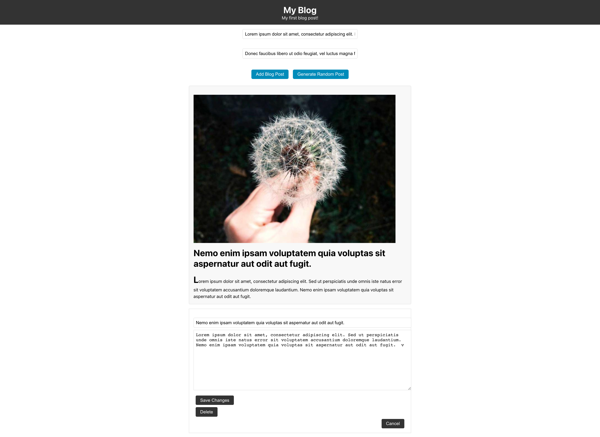

# Basic Blog Project

This is a basic blog project with functionality to add, delete, and edit posts. It is built with React and includes a random post generator.

## Usage
Clone the repository
Run npm install to install the dependencies
Run npm start to start the development server
Navigate to http://localhost:3000 in your browser

## App Overview
The App component is the main component of the application. It uses the useState hook to manage the state of the blog posts, the text and title of the current post being edited, the selected post index, the edited post object, and any error message.

### Add Post
When the Add Blog Post button is clicked, the addPost function is called, which checks that both the title and body of the post are not empty, sets an error message if they are, creates a new post object, adds it to the array of existing posts, and clears the title and text fields.

### Delete Post
When the Delete button is clicked for a given post, the deletePost function is called, which removes the post at the given index, resets the selected post index and edited post object, and updates the state.

### Generate Random Post
When the Generate Random Post button is clicked, the generatePost function is called, which uses a generateRandomPost function to create a random post title and body and sets them in the state.

### Edit Post
When the Edit button is clicked for a given post, the editSelectedPost function is called, which sets the selected post index and edited post object.

### Save Post Changes
When the Save Changes button is clicked for a given post being edited, the updatePost function is called, which updates the post at the selected index in the array of existing posts with the new edited post object, resets the selected post index and edited post object, and updates the state.

### BlogPost Component
The BlogPost component is a functional component that receives the post image, title, and body as props and renders them in a formatted manner.

## Styling
The App.css file contains the CSS styles used by the components in the application.

## Attribution
The project uses the Picsum Photos API to generate a random image for each post.
